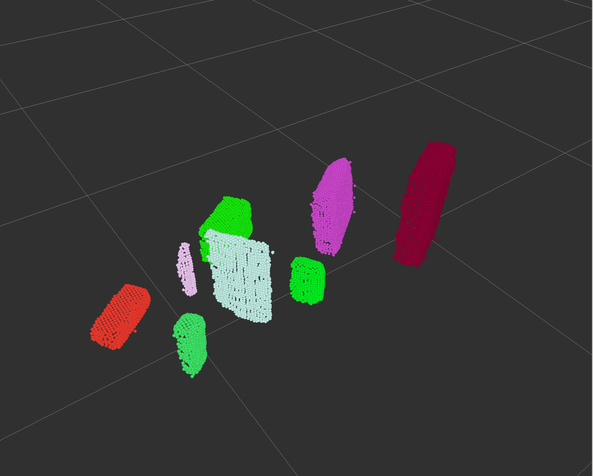
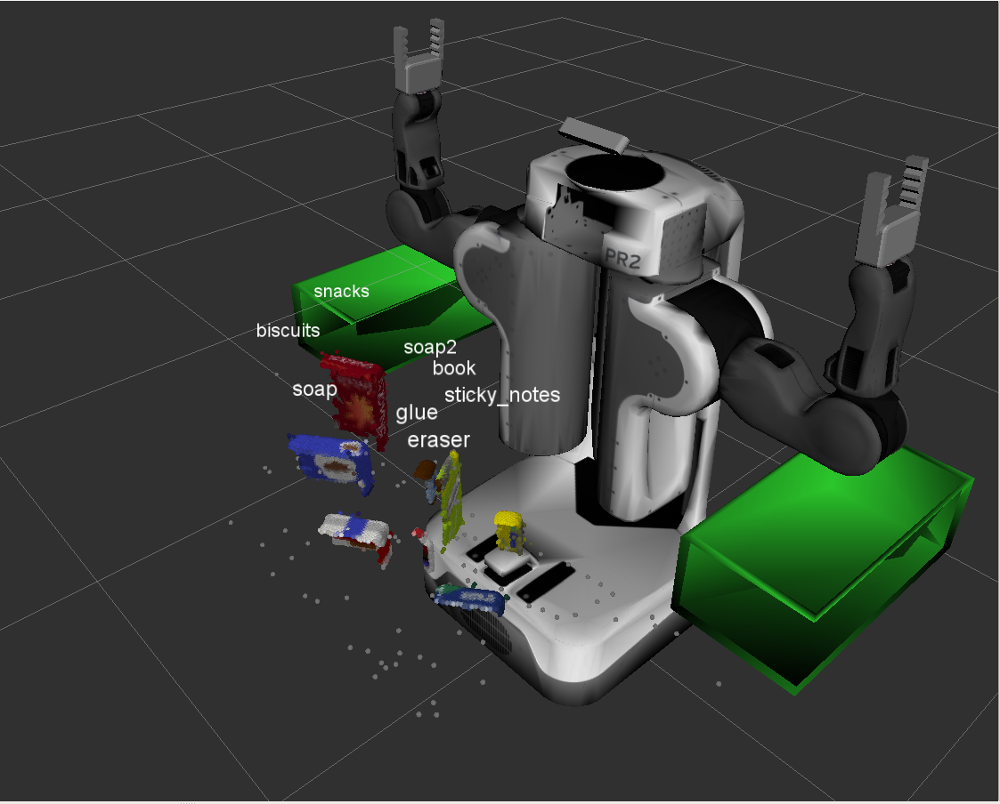

## Project: Perception Pick & Place

In this project, we will assimilate our work from previous exercises to successfully complete a tabletop pick and place operation using PR2.

The PR2 has been outfitted with an RGB-D sensor much like the one you used in previous exercises. This sensor however is a bit noisy, much like real sensors.

Given the cluttered tabletop scenario, you must implement a perception pipeline using your work from Exercises 1,2 and 3 to identify target objects from a so-called “Pick-List” in that particular order, pick up those objects and place them in corresponding dropboxes.

## Writeup

### Perception Pipeline

The code related to the perception pipeline located in [perception_pipeline.py](https://github.com/samuelpfchoi/RoboND-P3-Perception-Project/blob/master/pr2_robot/scripts/perception_pipeline.py)

There are no. of major steps involved in the pipeline:
* Point cloud filtering
* Table Segmentation
* Clustering Objects
* Object Recognition

The following figures will demonstrate the details of each major steps. First, the RGB-D sensor capture a noisy 3D point cloud as shown below

**Statistical Outlier Filter &  VoxelGrid Downsampling Filter**

The Statistical Outlier Filter was applied to remove noise and then, in order to have faster performance in coming steps, VoxelGrid Downsampling Filter was used to derive a point cloud that has fewer points.

**Pass Through Filter**

Since we had some prior information about the location of your target in the scene, you can apply a Pass Through Filter to remove useless data from your point cloud.

The Pass Through Filter works much like a cropping tool, which allows you to crop any given 3D point cloud by specifying an axis with cut-off values along that axis. The region you allow to pass through, is often referred to as region of interest.

**RANSAC Plane Fitting**

After the Pass Through Filter, the point cloud contained only tabletop & some object in the tabletop. The RANSAC Plane Fitting was used to seperate the tabletop and objects.

**Euclidean Clustering**

Now that you have filtered out the table plane, and all points outside of the region of interest, your point cloud should look like the image above. Euclidean Clustering was used to segment the remaining points into individual objects for object recognition step.

**Object Recognition**

Finally, A trained SVM classifier model was used to perform object recognition and the output label was added to above the object as shown below:

### Training SVM Model for Object Recognition

**Features**

Color histogram and normal histogram, that capture color information and shape information respectively, were used as feature for training SVM classifier.

**Generating Dataset for Training**

In gazebo simulation environment, runing a script to spawns each object in random orientations and computes features based on the point clouds resulting from each of the random orientations. Each object takes 1000 samples. When it finished running training_set.sav file was generated. The file containing the features and labels for the dataset for training the SVM classifier.

**Training SVM**

Train SVM with the dataset and the following figure showed its classification accurary with normalized confusion matrix.

### Results

With the perception pipeline, the objects in the scene can be recognized as shown below.

**Scene 1:**

**Scene 2:**

**Scene 3:**

 

